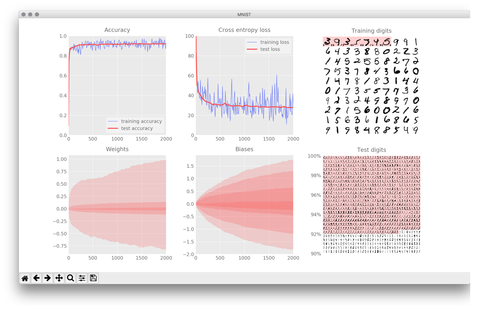
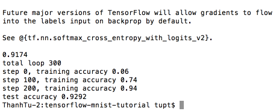

## Install Python3

MacOS:
`brew install python`
Linux:
`apt-get install python3.6`

## Install Tensorflow and Depedencies

```
    python3 -m pip install --upgrade tensorflow
    python3 -m pip --upgrade matplotlib
    python3 -m pip --upgrade numpy
```

## TEST YOUR INSTALLATION:

```
    cd tensorflow-mnist
    python3 mnist_1.0_softmax.py
```

Result is as following:  


---

## Test accuracy

`python3 test_accuracy.py 300`


_Disclaimer: If there was a problem, remember to set PYTHONPATH to the python's site-packages_
